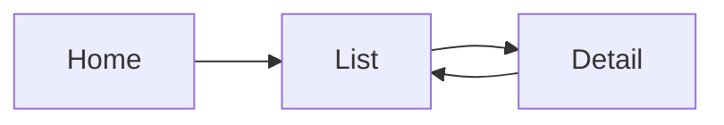

# Rule: Screen Transition Diagram Sheet (画面遷移図 / Screen Transition Diagram)

## Sheet name keywords

`画面遷移図`, `画面遷移`, `Screen Transition`, `Navigation`, `Screen Flow`, `Sơ đồ màn hình`, `Sơ đồ chuyển MH`, `Chuyển màn hình`, `Luồng màn hình`, `Điều hướng`

## Goal

The sheet describes the flow between screens/apps. Output: metadata + a screen-transition diagram as Mermaid + (if present) a Field Navigation table.

## Heading hierarchy

- YAML frontmatter (metadata — see section 1) at the very top of the file, before the H1
- Sheet name = `#` (H1)
- `★画面遷移図` (Screen Transition Diagram) section = `##` (H2)
- `【...】` Field Navigation section = `##` (H2)

## 1. Metadata — YAML frontmatter (machine-readable, for downstream chunking/retrieval)

Emit metadata as YAML frontmatter, not a bullet list, so a chunker can attach the same metadata to every chunk produced from the file.

**All 12 keys below are the standard schema shared by every sheet rule in this skill — every generated `.md` file has the SAME key set, in the SAME order, regardless of sheet type.** Keys that don't apply to this sheet (`class_name`, `current_version`, `file_name`) are still present, with an empty string value. This makes every file's frontmatter schema identical, so a downstream chunker/vector-DB never needs to check whether a key exists.

```yaml
---
document_type: ""
project_name: ""
business_name: ""
function_id: ""
function_name: ""
created_date: 2025-04-24
last_updated_date: 2025-04-24
last_updated_by: ""
sheet_name: ""
class_name: ""
current_version: ""
file_name: ""
---
```

Field mapping (source label → YAML key):

1. Document Type (種類) → `document_type` — MUST be exactly one of two fixed values: `概要設計書` (Basic Design) or `システム要件定義書` (Detailed Design). Determine it from the workbook's Cover sheet / file name; if genuinely undeterminable, leave `""` — do NOT invent a third value.
2. Project Name (プロジェクト名) → `project_name`
3. Business Name (業務名) → `business_name`
4. Function ID (機能番号) → `function_id` (keep as a string)
5. Function Name (機能名称) → `function_name`
6. Created Date (作成日) → `created_date` (convert to ISO `YYYY-MM-DD`)
7. Last Updated Date (最終変更日) → `last_updated_date` (same ISO conversion)
8. Last Updated By (最終変更者) → `last_updated_by`
9. `sheet_name` → the raw Excel sheet name, not translated
10. `class_name` → not applicable to this sheet; always `""`.
11. `current_version` → not applicable to this sheet; always `""`.
12. `file_name` → not applicable to this sheet; always `""`.

If a field is empty in Excel, keep the YAML key with an empty string value (`""`). Do NOT omit the key and do NOT fabricate a value.

## 2. Screen Transition Diagram (★画面遷移図)

Represent the diagram as a **Mermaid flowchart**. Do NOT store as an image. Pick the source in this priority order:

1. **Preferred — the rendered PNG(s) of this sheet** given in your task prompt. Read each image with the Read tool. Rebuild the boxes and arrows you can see. Node labels: shape text is NOT in the sheet's `normal_*.txt` — that file holds cell values only, and drawing/shape text never reaches it. Read node labels from the image. If a label's text also appears as a cell value in `normal_*.txt`, use that file's spelling instead of what you read from the image. When a label exists only in the image, transcribe it with particular care — Vietnamese diacritics and Japanese kanji are both easy to misread from a rendered image — and add a short note below the diagram that its labels were read from the image. Draw only arrows you can clearly see; do not infer a relationship from proximity alone. If an arrow's destination is unclear, leave it out and note it below the diagram.
2. **Fallback — reconstruct from text:** If this sheet has no PNG, build the flowchart from the box text in the intermediate markdown given in your task prompt. The PDF extraction loses connector arrows, so relationships may be incomplete — reconstruct only what the text clearly supports.
3. **Last resort — relationship table:** If neither source yields reliable relationships, output a relationship table instead of Mermaid:

   | From (Source Screen) | To (Target Screen) | Condition |
   |---|---|---|
   | ... | ... | ... |

Keep everything the source provides: Screen (画面), Application, Action / Button, screen-transition condition, navigation direction, relationships between screens.



## 3. Field Navigation (【画面項目ナビゲーション】)

If the sheet has a section like `【画面遷移時に項目押下】`, `【画面遷移時に各項目押下】` (or equivalent "navigate on field tap") → convert it to a **Navigation Mapping Table**.

**Columns are DYNAMIC based on the data actually present** — do not create empty columns:

- Core columns (usually always present): Source Screen | Field | Target Object | Target App
- Extra columns, ONLY added when the sheet has the data: Navigation Condition | Search Condition | Parameter Mapping

### Example

```markdown
| Source Screen | Field | Target Object | Target App |
|---|---|---|---|
| Purchase Order List | Purchase Order | Display Purchase Order | Manage Purchase Orders |
| Purchase Order List | Vendor | Display Business Partner | Manage Business Partner |
| Purchase Order List | Material | Display Material | Manage Product Master |
```

## Constraints

- Do NOT omit any screen/relationship in the diagram.
- Navigation table: output only columns that have data; keep all rows.
- If a metadata field is empty, keep the line with an empty value. Do NOT fabricate.
